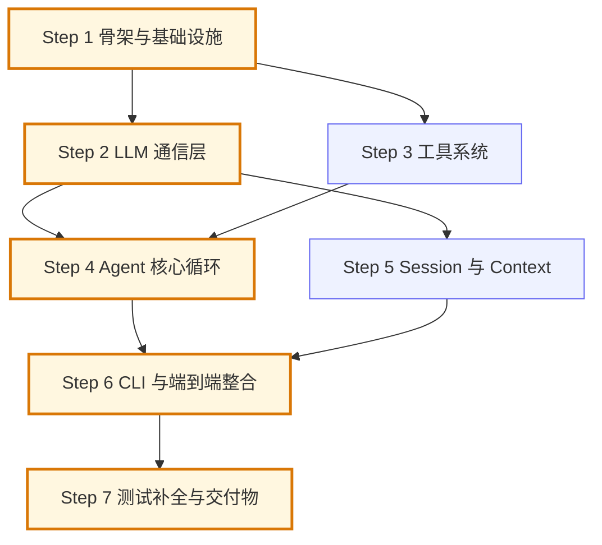

# small_agent 开发路线图（Roadmap）

> 依据 `readme.md` 的提交要求规划：从零实现最小可用 Agent（核心 Runtime 自行实现），
> 实现基本循环、工具注册机制、session 管理与 context 管理，构建测试用例，
> 交付真实 LLM API 代码 + README（运行方式/系统设计/memory 说明）+ AI Prompt 与问题解决记录。

## 一、规划原则

1. **均分**：整个开发划分为 **7 个步骤**，每步工作量大致相等（约占总量的 1/7）。
   每步都包含「编码 + 单元测试 + 验收」，不把测试集中堆到最后一步。
2. **上下文可兜底**：每步限定在**单一模块 / 单一关注点**内，从设计 → 编码 → 单测 → 验收
   在一个开发周期内闭环完成；一步完成后其产出即成为下一步的稳定输入。
3. **每步可独立验证**：每个步骤结束都有一个可运行的产物（跑得通的代码 + 通过的测试），
   不出现"半成品堆积到某一步才见光"的情况。
4. **拓扑驱动**：步骤顺序由依赖关系（DAG）决定，而不是简单排期；严格依赖不可乱序，
   软依赖明确标注，存在并行窗口时允许双轨开发（见第三节）。
5. **契约先行、冻结关键契约**：跨步骤共享的接口（Message 模型、工具调用格式）在前置步骤定义，
   一旦后续步骤开始消费即视为冻结，只扩展不破坏性修改，避免分支汇合时返工。

## 二、总体架构（目标态）

```
small_agent/
├── agent/
│   ├── __init__.py
│   ├── config.py        # 配置加载（.env / 环境变量）
│   ├── core/            # 消息模型、Agent 主循环
│   ├── llm/             # LLM 客户端、输出解析
│   ├── tools/           # 工具系统（注册机制 + 内置工具）
│   └── session/         # 会话管理、上下文管理（含基础压缩）
├── tests/               # 单元 / 集成 / 端到端测试
├── logs/                # 运行日志与工具 trace
├── .env.example         # 环境变量模板
├── pyproject.toml
├── docs/                # bug / code / roadmap 记录
└── README.md
```

依赖方向：`core` → `llm` / `tools`；`core` 不持有会话状态，`session` 为 `core` 提供消息上下文，
CLI 负责把三者组装起来。

## 三、拓扑依赖分析（DAG）

**结论**：7 个步骤构成**有向无环图（DAG）**，全部依赖单向向前，不存在反向或循环依赖——
「必须先完成步骤 2 才能完成步骤 1」这类反向关系在本计划中不成立；**Step 1 是唯一无前置的根步骤**，
Step 6 是最终汇合点，Step 7 是终点。

### 3.1 严格依赖边（必须满足，不可乱序）

| 边 | 含义 |
|----|------|
| S1 → S2 | LLM 层需要 S1 的配置 / 日志 / 异常体系 |
| S1 → S3 | 工具层需要 S1 的异常体系（ToolError）与日志 |
| S2 → S4 | 循环需要消息模型 / LLM 客户端 / 解析器 |
| S3 → S4 | 循环需要 ToolRegistry 执行工具 |
| S2 → S5 | 会话与压缩需要消息模型与 LLM 客户端（摘要） |
| S4 → S6 | 整合需要可用的主循环 |
| S5 → S6 | 整合需要可用的会话与上下文管理 |
| S6 → S7 | 交付物基于整合后的完整系统 |

### 3.2 软依赖（建议顺序 / 验证口径，不阻塞但应遵守）

- **S3 遵循 S2 的调用契约**：工具调用的格式（函数名 + 参数 JSON）由 S2 的解析器按
  OpenAI 兼容格式定义，S3 按同一契约产出 Schema。两者技术上可并行，
  但**建议 S2 先于 S3**：先冻结格式约定，避免 S4 汇合时返工。
- **S5 的「带工具追问」验证依赖 S4**：S5 内部以 mock 数据验证上下文衔接；
  「带工具追问」的端到端验证放到 S6（此时循环与工具均已就绪）。

### 3.3 关键路径与并行窗口

- **关键路径（决定总工期）**：`S1 → S2 → S4 → S6 → S7`（共 5 步）
- **并行窗口**：S2 ∥ S3（S1 完成后即可双开）；S5 可与 S3 / S4 并行（S2 完成后即可启动）
- **契约冻结点**：S2 完成的 Message 模型与工具调用格式（S4 / S5 / S6 均依赖，变更成本最高）



> 图例：橙色粗框 = 关键路径节点；蓝色 = 并行分支节点；箭头 = 严格依赖（必须按序）。

## 四、分步计划（含依赖标注）

---

### Step 1：项目骨架与基础设施

**前置依赖**：无（唯一根步骤）

**目标**：搭好工程骨架，让后续每一步都有稳定的落点（目录、配置、日志、异常）。

**任务清单**
- 建立上述目录结构，`pyproject.toml` 声明依赖（openai SDK、python-dotenv、pytest）
- `config.py`：从 `.env` / 环境变量加载 LLM 配置（api_key、base_url、model、max_rounds、
  上下文阈值、日志级别等），缺失配置给出明确报错
- 统一日志：控制台 + 文件输出，为工具 trace 预留独立 logger
- 异常体系：`AgentError` 基类 + `ConfigError / LLMError / ToolError / SessionError`

**产出文件**：目录骨架、`pyproject.toml`、`.env.example`、`agent/config.py`、日志与异常模块

**验收标准**
- `python -m agent`（空壳）可启动不报错
- 配置可正常加载、缺 key 时给出可读错误
- 日志能写入 `logs/`；单测覆盖配置加载与异常层级

---

### Step 2：LLM 通信层（消息模型 + 客户端 + 输出解析）

**前置依赖**：Step 1（严格）；本步产出 Message 模型与工具调用格式，是**契约冻结点**

**目标**：打通真实 LLM API 调用，并具备可靠的输出解析能力——这是 Agent 自主决策的基础。

**任务清单**
- 消息数据模型：`Message`（role / content / tool_calls / tool_call_id / name 等）
- `LLMClient`：调用真实 OpenAI 兼容 API（chat.completions，支持 tools 参数），
  超时与指数退避重试
- 输出解析器 `Parser`：
  - 原生 function calling 响应解析（tool_calls 字段）
  - 文本内 JSON 函数调用格式兜底解析（如 ```json 代码块）
  - 提取三类产物：**思考过程 / 工具调用 / 最终答案**
- 解析失败时的降级策略（视为普通文本回答，并记录日志）

**产出文件**：`agent/core/messages.py`、`agent/llm/client.py`、`agent/llm/parser.py`

**验收标准**
- 单测覆盖解析器各分支（mock 响应）：原生工具调用、文本 JSON 兜底、纯文本回答、畸形输出
- 客户端支持超时 / 重试参数；真实 API 冒烟测试可选（需 API key）

---

### Step 3：工具系统与内置工具

**前置依赖**：Step 1（严格）；建议在 Step 2 之后开发（软，遵循其调用契约）

**目标**：实现工具注册机制，并交付至少 3 个工具，让 LLM 可以"基于 Schema 自主决策调用"。

**任务清单**
- `BaseTool` 抽象：name、description、parameters（JSON Schema）、execute()
- `ToolRegistry`：register / get / list / 转 OpenAI functions schema / 统一执行与异常包装
- 内置工具：
  - `calculator`：安全表达式求值（白名单函数、长度限制，防注入）
  - `search`：mock 实现（内置小型知识库检索，返回预设结果）
  - `todo`：内存待办（增 / 查 / 删 / 清空），为 session 场景提供演示载体
- 工具执行日志：参数、结果摘要、耗时

**产出文件**：`agent/tools/base.py`、`agent/tools/registry.py`、`agent/tools/builtin/*`

**验收标准**
- 注册 / 列出 / 转 Schema / 调用均有单测
- 非法参数与执行异常被统一包装为 `ToolError`，不裸抛
- calculator 对注入表达式（如 `__import__`、超长表达式）安全拒绝

---

### Step 4：Agent 核心循环

**前置依赖**：Step 2 + Step 3（严格，首个汇合点：模型线 ∪ 工具线）

**目标**：实现 readme 要求的四步 Loop，并带轮次限制与完整 trace。

**任务清单**
- `AgentRuntime.run(user_input, context)` 主循环：
  - 组装 messages → 调 LLM → 判断是最终答案还是工具调用
  - 工具调用：逐个执行 → 结果回填 → 继续循环；否则返回最终答案
- **最大轮次限制**：超限即终止并明确提示
- **基本异常处理**：工具执行失败不崩溃，把错误反馈给 LLM 继续尝试（或按策略终止）
- **trace / 执行日志**：每轮 LLM 请求与响应摘要、每次工具调用的时间 / 参数 / 结果 / 耗时

**产出文件**：`agent/core/runtime.py`

**验收标准**
- mock LLM 单测覆盖：直接回复分支、工具调用分支、轮次上限分支、工具异常分支
- 每次工具调用在日志中有完整 trace 记录

---

### Step 5：Session 与 Context 管理

**前置依赖**：Step 2（严格）；可与 Step 3 / Step 4 并行开发；
「带工具追问」端到端验证延至 Step 6

**目标**：多窗口独立会话 + 状态记忆 + 追问 + 基础压缩，这是 readme 的重点难点。

**任务清单**
- `Session`：session_id、历史消息、元信息（创建时间、轮次计数）
- `SessionStore`：内存 + JSON 文件持久化（重启可恢复），按 session_id 完全隔离
- **Context 组装策略**（哪些信息入 context）：
  - 入：system prompt、用户输入、工具执行结果、必要的历史消息
  - LLM 思考过程：按需保留（用于压缩摘要场景），不默认全部塞入
- **最大轮次 / 上下文控制**：超阈值后对最旧片段做**基础压缩**（LLM 摘要或规则摘要，
  摘要占位注入，旧消息释放），新问题优先保留
- **追问支持**：纯对话追问、带工具的追问在同一 session 内自然衔接（S5 内以 mock
  工具消息验证上下文衔接；完整验证在 Step 6）

**产出文件**：`agent/session/session.py`、`agent/session/store.py`、`agent/session/context.py`

**验收标准**
- 单测：会话 A / B 互不影响；持久化后可恢复；压缩触发与摘要注入正确
- 单测：追问场景（纯对话、带工具，用 mock 工具消息）上下文衔接正确

---

### Step 6：CLI 交互与端到端整合

**前置依赖**：Step 4 + Step 5（严格，最终汇合点：循环 ∪ 会话）

**目标**：把所有模块组装成一个可实际使用的命令行 Agent，用真实 LLM API 跑通。

**任务清单**
- REPL 入口 `python -m agent`，支持多窗口命令：
  `/new`（新会话）、`/list`（列出会话）、`/switch <id>`（切换）、`/resume`、`/exit`
- 整合：CLI → SessionStore → Context 组装 → AgentRuntime → LLMClient / ToolRegistry
- 用户可见的工具调用过程展示（可选开关，默认展示简要 trace）
- 端到端联调：修正整合中发现的问题

**产出文件**：`agent/cli.py`（或 `agent/__main__.py`）

**验收标准**
- 真实 API 手动走通：开两个窗口互不影响；追问（纯对话 + 带工具）正常
- 全部 CLI 命令可用，异常输入不崩溃

---

### Step 7：测试补全与交付物

**前置依赖**：Step 1–6 全部完成（严格，终点步骤）

**目标**：补齐测试并产出 readme 要求的全部提交内容。

**任务清单**
- 补齐集成 / 端到端测试用例，逐项覆盖 readme「要求 3」全部功能点：
  loop 流转、工具决策、session 隔离、context 压缩、异常处理、trace 日志
- 重写 `README.md`：运行方式、系统设计、**memory 的召回时机与放置方式**说明
- 交付 `AI Prompt 与问题解决记录`（写入 `docs/prompt.md`，
  并同步完善 `docs/bug.md`、`docs/code.md`）
- 最终自查：`pytest` 全绿；按 README 在全新环境可跑通

**产出文件**：`tests/` 补齐、`README.md`、`docs/prompt.md`（及 bug/code 记录）

**验收标准**
- `pytest` 全部通过；按 README 步骤可复现运行
- 三份交付物齐全：代码链接（GitHub 已连接）、README、AI Prompt 与问题解决记录

---

## 五、推荐开发顺序与并行窗口

**顺序开发（单人逐步推进，推荐）**

```
S1 → S2 → S3 → S4 → S5 → S6 → S7
```

理由：严格依赖全部满足；S3 紧跟 S2 让契约先行（软依赖）；S5 排在 S4 之后可顺带完成
「带工具追问」的半集成验证（用 S3 的真实工具 + mock LLM），S6 再全链路联调。

**并行开发（双轨 / 多人）**

- 轨道 A（模型线，关键路径）：S2 → S4
- 轨道 B（能力线）：S3（S1 完成后即可启动，汇入 S4）
- 轨道 C（状态线）：S5（S2 完成后即可启动，汇入 S6）
- 集成检查点：**S4**（循环 + 工具首次跑通）、**S6**（全链路端到端跑通）

## 六、工作量分配一览

| 步骤 | 主题 | 核心产出 | 严格依赖 | 并行窗口 | 关键路径 |
|------|------|----------|----------|----------|----------|
| Step 1 | 项目骨架与基础设施 | 目录 / 配置 / 日志 / 异常 | 无 | - | ✔ |
| Step 2 | LLM 通信层 | 消息模型 + 客户端 + 解析器 | S1 | 与 S3 并行 | ✔ |
| Step 3 | 工具系统 | 注册机制 + calculator/search/todo | S1 | 与 S2 并行 | |
| Step 4 | Agent 核心循环 | loop + 轮次限制 + trace | S2 + S3 | - | ✔ |
| Step 5 | Session 与 Context | 会话隔离 / 持久化 / 压缩 / 追问 | S2 | 与 S3/S4 并行 | |
| Step 6 | CLI 与端到端整合 | REPL 多窗口 + 真实 API 联调 | S4 + S5 | - | ✔ |
| Step 7 | 测试补全与交付物 | 全量测试 + README + AI Prompt 记录 | 全部 | - | ✔ |

> 每步约占总工作量 1/7；S2 与 S3、S5 具备并行窗口，但单人顺序开发仍按推荐顺序推进。
